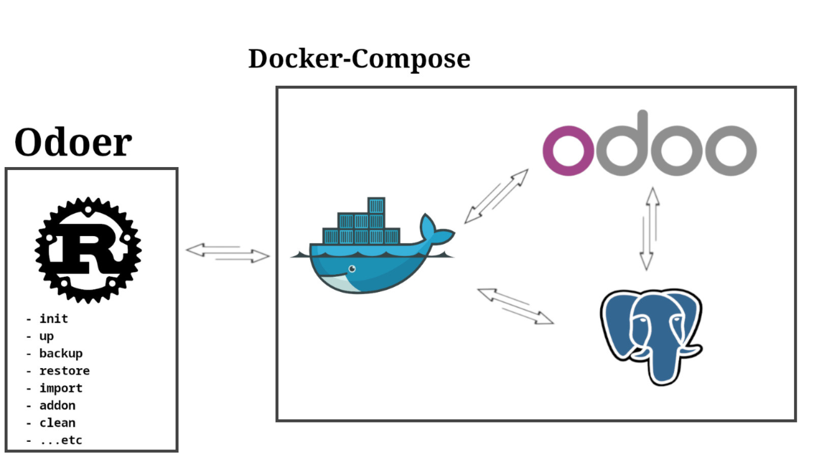

# Odoer – Odoo Docker Manager

**Odoer** (Dockerizing Odoo) is a command-line Rust application designed to simplify managing **Odoo + Docker Compose** environments with a suite of essential commands.



Developed with a focus on clarity, security, and automation.

---

## Features

- Manages Odoo environments using `docker-compose`
- Backup and restore support for database, filestore, and addons
- Initializes Odoo with required database setup
- Module updates.
- Synchronizes extra addons between host and container
- Real-time Docker log viewing
- Clean, compressed backup archives.
- Container and volume cleanup with confirmation
- Configurable project directory support

---

## Usage

By default, Odoer assumes the project is located at:

```

/home/admin/odoo

````

To use the default:

```bash
./odoer <command>
````

To pass the password instead:

```bash
./odoer -p $PASS <command>
```

To use a different project directory:

```bash
./odoer -d /path/to/project <command>
```

### Available Commands

| Command          | Description                                       |
| ---------------- | ------------------------------------------------- |
| `init`           | Initialize Odoo database with base schema         |
| `up`             | Stop and bring up the Odoo stack                  |
| `start` / `stop` | Start or stop the containers                      |
| `restart`        | Restart Odoo and PostgreSQL containers            |
| `update`         | Upgrade all modules using `-u all`                |
| `addon`          | Sync `extra-addons` from host to container        |
| `logs`           | View real-time logs from docker-compose           |
| `backup`         | Create a full backup of database and filestore    |
| `import <dir>`   | Import and restore from a given backup directory  |
| `restore <dir>`  | Backup first, then perform an import              |
| `clean`          | Deletes containers and volumes after confirmation |
| `list`           | List available backup folders sorted by date      |

---

## Project Directory Structure

By default, Odoer expects the following structure:

```
/home/admin/odoo/
├── docker-compose.yml
├── extra-addons/
├── backups/
└── backups.log
```

If using a different location, supply `-d /your/path` on every command.

---

## Password-Protected Commands

The following commands require password input:

* `init`
* `up`
* `update`
* `addon`
* `clean`
* `import`
* `restore`
---

## **Automating Backups with Cron**  
To schedule a daily backup at **2:00 AM**, add this cron job:  
```bash
crontab -e
```
Then add the following line:  
```bash
0 2 * * * /path/to/odoer [-d path] backup >> /var/log/odoo_backup.log 2>&1
```
This runs the backup script **every night at 2:00 AM** and logs output to `/var/log/odoo_backup.log`.

---

## License

Released under the MIT/X License.
> RTFM, 
> KISS

---
Developed by Mahmoud Elshimi
Email: [mahmoudelshimi@protonmail.ch](mailto:mahmoudelshimi@protonmail.ch)
Phone: +20 100 312 3253
